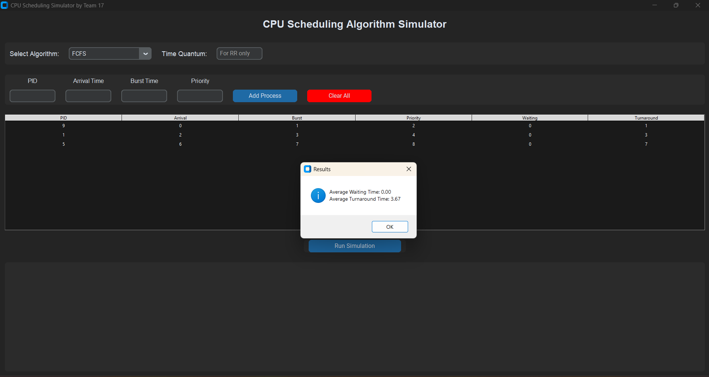
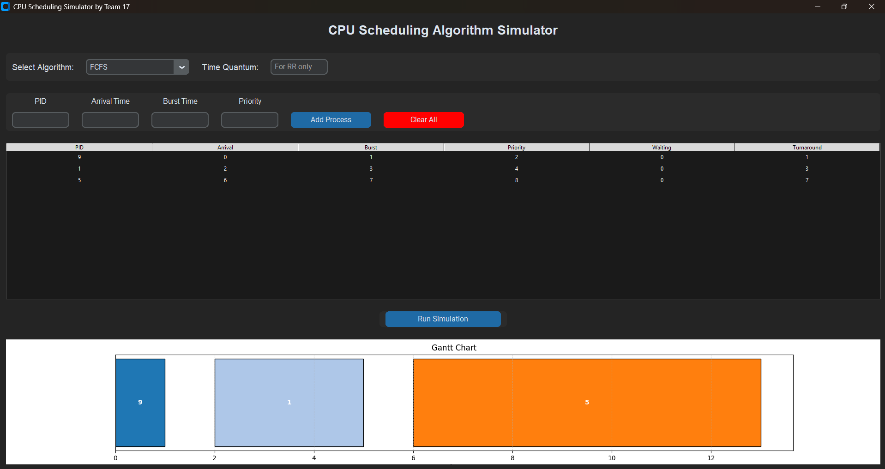

# 🧠 CPU Scheduling Algorithm Simulator

A modern and interactive desktop simulator built with **Python (Tkinter + CustomTkinter + Matplotlib)** to visualize and understand different **CPU Scheduling Algorithms** such as FCFS, SJF, Priority, and Round Robin.

---

## 📸 Screenshots

### 🔹 FCFS Simulation (Example 1)


### 🔹 FCFS Simulation (Example 2 with Gantt Chart)


---

## ⚙️ Features

✅ User-friendly GUI using **CustomTkinter**  
✅ Supports **multiple scheduling algorithms**:
- **FCFS (First Come First Serve)**
- **SJF (Shortest Job First)**
- **Priority Scheduling**
- **Round Robin**

✅ Displays:
- **Waiting Time**
- **Turnaround Time**
- **Average Waiting & Turnaround Time**
- **Gantt Chart Visualization**

✅ Dynamic **process addition**, **clearing**, and **real-time simulation results**

---

## 🧩 Algorithms Implemented

| Algorithm | Type | Description |
|------------|------|-------------|
| **FCFS** | Non-Preemptive | Executes processes in the order they arrive. |
| **SJF** | Non-Preemptive | Executes the process with the shortest burst time next. |
| **Priority Scheduling** | Non-Preemptive | Chooses process with the highest priority (lowest number). |
| **Round Robin (RR)** | Preemptive | Allocates CPU time in equal time slices (quantum). |

---

## 🧮 Example

**Input:**
| PID | Arrival Time | Burst Time | Priority |
|-----|---------------|-------------|-----------|
| 9 | 0 | 1 | 2 |
| 1 | 2 | 3 | 4 |
| 5 | 6 | 7 | 8 |

**Output:**
- Average Waiting Time: **0.00**
- Average Turnaround Time: **3.67**

---

## 🖥️ Installation & Setup

### 1️⃣ Clone the repository
```bash
git clone https://github.com/<your-username>/CPU-Scheduling-Simulator.git
cd CPU-Scheduling-Simulator
````

### 2️⃣ Install dependencies

Make sure Python 3.8+ is installed, then run:

```bash
pip install customtkinter matplotlib
```

### 3️⃣ Run the simulator

```bash
python CPU_Scheduling_simulator.py
```

---

## 📊 Gantt Chart Example

The Gantt chart dynamically visualizes process execution order and duration:

```
| P9 |---| P1 |-------| P5 |------------->
Time:  0    2     6            13
```

---

## 🧠 Built With

* **Python 3**
* **CustomTkinter**
* **Tkinter (for GUI layout)**
* **Matplotlib (for Gantt Chart visualization)**

---

## 👨‍💻 Developed By

**Team 17**
🚀 Department of Computer Science & Engineering
💡 SRM University, Chennai

---

## 🪪 License

This project is open-source and available under the [MIT License](LICENSE).

---

### ⭐ If you found this useful, give it a star on GitHub!

```

---

Would you like me to include a **“How it works”** section explaining the internal logic of each algorithm (for documentation or academic submission)?
```
